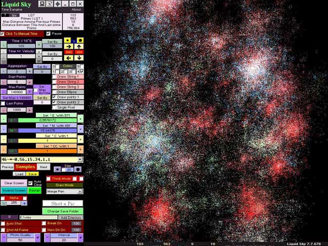



## Time Engine 774

### Description

This Code Don't Use Any Formula For Drawing.

Sub DrawP1()-- Drawing With Only Prime Numbers Analysis.

By This Method We Can Simulate All Natural Actions.
 
### More Info
 

             |
---                |---
**Submitted On**   |2010-03-26 23:24:48
**By**             |[Kaveh Abdollahi](https://github.com/Planet-Source-Code/PSCIndex/blob/master/ByAuthor/kaveh-abdollahi.md)
**Level**          |Advanced
**User Rating**    |5.0 (15 globes from 3 users)
**Compatibility**  |VB 6\.0
**Category**       |[Complete Applications](https://github.com/Planet-Source-Code/PSCIndex/blob/master/ByCategory/complete-applications__1-27.md)
**World**          |[Visual Basic](https://github.com/Planet-Source-Code/PSCIndex/blob/master/ByWorld/visual-basic.md)
**Archive File**   |[Time\_Engin2178003272010\.zip](https://github.com/Planet-Source-Code/kaveh-abdollahi-time-engine-774__1-73038/archive/master.zip)

